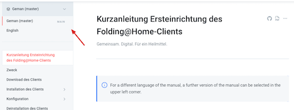

# Kurzanleitung Ersteinrichtung des Folding@Home-Clients


For a different language of the manual, a further version of the manual can be selected in the upper left corner.


An dieser Stelle möchten wir Euch eine Anleitung zur Einrichtung der Folding@Home-Clients zu Gunsten der COVID-19-Forschung an einem gemeinsamen, privaten Engagement mitzuwirken.

Über die Navigation am linken Bildschirmrand könnt ihr die Schritte zur Einrichtung des Clients nachlesen. Im Grunde ist es aber ganz einfach:

1. [Download des Clients](download-des-clients.md)
2. [Installation des Clients](installation-des-clients/)
3. [Konfiguration des Clients](konfiguration/); folgende Werte sind für unser Team anzugeben

|  Einstellung | Wert​ |
| :--- | :--- |
| Project | COVID-19 |
| Team name | The Red Insurance Lions - Worldwide |
| Team ID | 263581 |

Danach arbeitet das Programm bei jedem Systemstart automatisch in Hintergrund und unterstützt das Folding@Home-Projekt und unser Team.


Wir bieten in der Zwischenzeit auch eine Backend-Komponente zur Ermittlung des Team-Ranking an. Wir können dadurch jede Veränderung eines Rankings ermitteln und nachvollziehen. Diese Funktion ist als Python in einem Docker flexible einsetzbar und kann auf jedes beliebige Team angepasst werden. Du findets weitere Informationen im Ordner [Backend](https://github.com/generaliinformatik/fah-red-lions/tree/master/backend).


In diesem Sinne:

Happy contributing!

