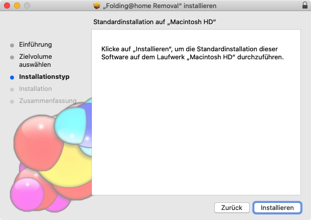

# Deinstallation on Mac

By default, the Finder displays the entry "_Applications_" in the left bar. This is to be selected. The Finder will then display the Applications folder. In this folder there is a subfolder "_Folding@Home_". Double-click it to open it. 

The programs of the client are displayed in this folder. The entry "_Uninstall Folding@home.pkg_" is displayed. This must be started for the uninstallation. 

The welcome dialog appears:

Selecting _Continue_ displays the second dialog to start the uninstallation:

Even if the button is called _Install_, selecting the button will remove the software from the system. What is meant is that the scripts that terminate and remove the background process are thus started.

After selecting the button, the F@H client is removed from the system.

