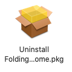
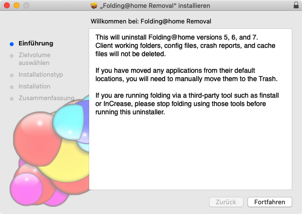
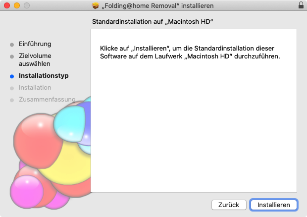

# Deinstallation unter Mac

Im Finder wird standardmäßig in der linken Leiste der Eintrag "_Programme_" angezeigt. Dieser ist auszuwählen.

Es wird daraufhin der Programm-Ordner im Finder angezeigt. In diesem befindet sich ein Unterordner "_Folding@Home_". Dieser ist per Doppelklick aufzurufen.

In dem angezeigten Ordner werden die Programme des Clients dargestellt. Der Eintrag "Uninstall Folding@home.pkg" wird angezeigt. Dieser ist für die Deinstallation zu starten. 

Es erscheint der Willkommens-Dialog:

Mit Auswahl von _Fortfahren_ wird der zweite Dialog zum Starten der Deinstallation angezeigt:

Auch wenn die Schaltfläche _Installation_ heißt, wird mit Auswahl der Schaltfläche die Software von dem System entfernt. Gemeint ist, dass die Skripte, die den Hintergrundprozess beenden und entfernen, damit gestartet werden.

Nach Auswahl der Schaltfläche ist der F@H-Client vom System entfernt.

