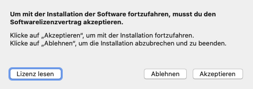

# Installation on Mac

To start the installation, start the downloaded installation file:

As the installation file is not signed, the user has to perform the installation via context menu by right-clicking on the file and selecting Open.

A dialog appears asking that the file cannot be verified and whether it should be executed anyway. This must be confirmed with Open:

The first installation dialog appears showing the license:

The installation can be continued with the Continue button. The license confirmation prompt appears:

Accept confirms the license and continues the installation:

The Install button performs the installation on the default volume:

The files are written to the drive. After all files have been written, the necessary configurations have been created and the background process has been set up, the installation is complete:

Click the Close button to complete the installation. The system may ask whether the installation file that is no longer required should be moved to the recycle bin.

This can be confirmed at your convenience. The overview of the client running in the background then appears in the standard web browser of the system. Now the client can be adjusted to the project and the team.

