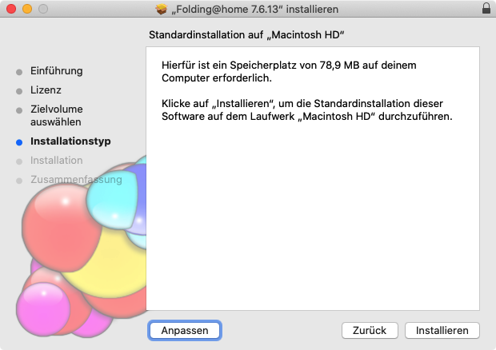

# Installation unter Mac

Zum Starten der Installation ist die heruntergeladene Installationsdatei zu starten

Da die Installationsdatei nicht signiert ist, muss der Anwender die Installation per Kontextmenü über die rechte Maustaste auf der Datei und Auswahl von Öffnen ausführen.

Es erscheint ein Dialog, der nachfragt, dass die Datei nicht verifiziert werden kann und ob diese dennoch ausgeführt werden soll. Dies ist mit Öffnen zu bestätigen:

Es erschein der erste Installationsdialog mit der Anzeige der Lizenz:

Mit der Schaltfläche Fortfahren kann die Installation fortgeführt werden. Es erscheint die Bestätigungsabfrage der Lizenz:

Mit Akzeptieren wird die Lizenz bestätigt und die Installation fortgeführt:

Mit der Schaltfläche Installieren wird die Installation auf dem Standardlaufwerk durchgeführt:

Die Dateien werden auf das Laufwerk geschrieben. Nachdem alle Dateien geschrieben , die nötigen Konfigurationen angelegt und der Hintergrundprozess eingerichtet worden sind, ist die Installation abgeschlossen:

Mit der Schaltfläche Schließen ist die Installation vollständig. Das System fragt unter Umständen, ob die nun nicht mehr benötigte Installationsdatei in den Papierkorb bewegt werden soll.

Dies kann nach eigenen Belieben bestätigt werden. Danach erscheint die Übersicht des im Hintergrund laufenden Clients im Standard-Webbrowser des Systems. Jetzt kan der Client auf das Projekt und das Team eingestellt werden.

