# Installation unter Windows

Dieser Abschnitt beschreibt die benutzerdefinierten Installation des F@H-Clients unter Windows XP und neuer. Es wird von einer Erstinstallation ausgegangen, und sofern nicht anders angegeben, ist die Standardeinstellung für jede Option die empfohlene Einstellung.


Für die Installation des F@H-Clients zur Ausführung als Dienst \(eine Option etwas später im Setup\) muss das Windows XP-Benutzerkonto, unter dem das Installationsprogramm läuft, über Administratorrechte verfügen.


In Windows Vista und neueren Versionen muss das Installationsprogramm mit der Option Als Administrator ausführen geöffnet werden. Klicken Sie dazu mit der rechten Maustaste auf das Symbol des Installationsprogramms und dann auf Als Administrator ausführen. Wenn Sie zur Eingabe eines Administrator-Passworts oder zur Bestätigung aufgefordert werden, geben Sie das Passwort ein oder bestätigen Sie es.


Da Rechte eines Administrators erforderlich sind, wird die Installation auf Firmen-Systemen vielfach nicht möglich sein. Die Software ist für den Einsatz auf Firmen-eigener Hardware **nicht** freigegeben, daher bitten wir Euch, die Software nur auf privaten Systemen einzusetzen!


Doppelklicken Sie den heruntergeldenen Installer, um die Software-Installation zu starten. Möglicherweise wird beim Start eine Sicherheitswarnung angezeigt:

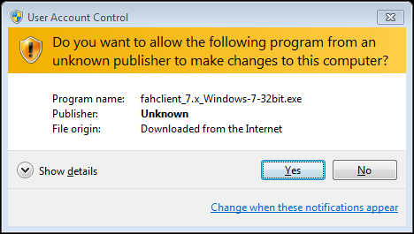

Wenn Sie dazu aufgefordert werden, klicken Sie auf Ausführen oder auf Ja, um die Warnung zu bestätigen und die Installation fortzusetzen. 

Der Begrüßungsbildschirm wird angezeigt. Klicken Sie auf Weiter, um die Installation fortzusetzen.

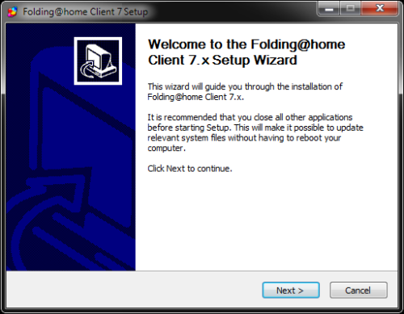

Lesen Sie die Lizenzvereinbarung.

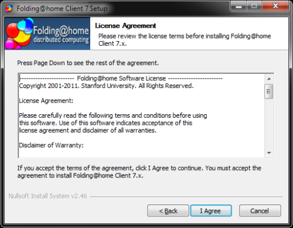

Wenn Sie einverstanden sind, klicken Sie auf _I Agree_, um fortzufahren.

Der Optionsbildschirm für den Installationsmodus wird angezeigt.

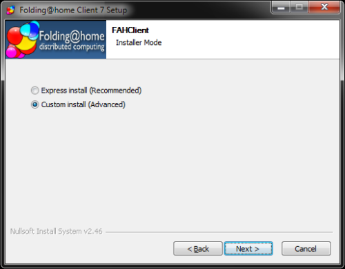

Wählen Sie die Option Benutzerdefinierte Installation \(Erweitert\) wie abgebildet. Klicken Sie auf Weiter, um fortzufahren. Der Bildschirm Benutzer auswählen wird angezeigt:

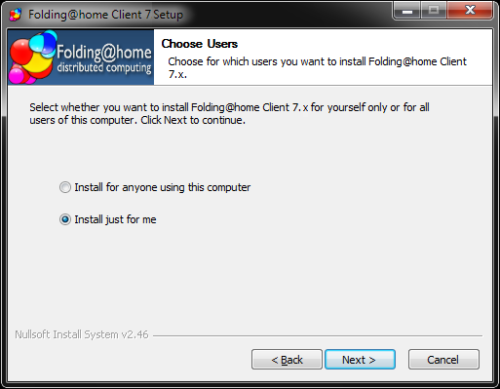

Wählen Sie eine Option, für welche Benutzer die Software ausführt werden soll. Eine Installation nur für den angemeldeten Benutzer wird empfohlen. Klicken Sie auf Weiter.

Der Bildschirm für den Installationsort wird angezeigt.

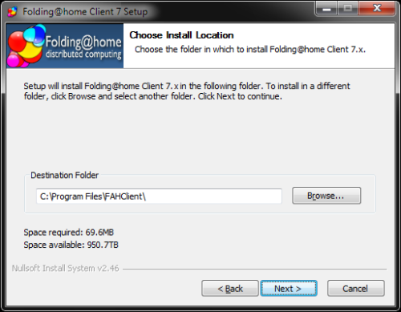

Es kann ein alternativer Zielordner eingegeben werden, aber die vorgeschlagene Vorgabe wird empfohlen. Klicken Sie auf Weiter, um fortzufahren.

![Anstelle von \[User\_Name\] wird der aktuelle Windows-Kontoname angezeigt.](../.gitbook/assets/wininst07.png)

Der Bildschirm für den Speicherort der Kundendatendateien wird angezeigt. 

Ein alternativer Datenverzeichnisordner kann für die Konfiguration und den Speicherort der Datendateien eingegeben werden. Dies ist jedoch der empfohlene Standard. Klicken Sie auf Weiter.

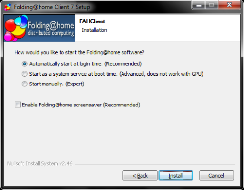

Die Optionen zum Start der Software werden angezeigt. Diese sind sehr wichtig, um festzulegen, wie der F@H-Client zukünftig gestartet wird. Außerdem wird ausgewählt, ob und wie der F@H-Client auf diesem Rechner von FAHControl gesteuert und überwacht werden.

Die in der Abbildung dargestellten Optionen zum automatischen Start entsprechen den bei der Express-Installation verwendeten Standardeinstellungen und sind die empfohlenen Einstellungen. Oder wählen Sie unten benutzerdefinierte Startoptionen aus.

Die erste Option legt den F@H-Client so fest, dass er bei der Windows-Anmeldung startet. Die zweite Option stellt den F@H-Client so ein, dass er als Service läuft und nur in der FAHControl-Oberfläche sichtbar ist. Die dritte Option wird verwendet, um den F@H-Client manuell über eine Verknüpfung zu starten. Die letzte Option \(Kontrollkästchen\) aktiviert den Bildschirmschoner-Modus von Folding@Home. 

Klicken Sie auf Installieren, um fortzufahren. Bitte warten Sie, bis Folding@Home die Installation abgeschlossen hat.

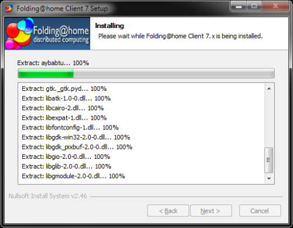

Die Installation des Clients ist fast abgeschlossen:

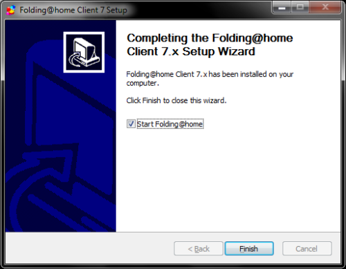

Hinweis: Deaktivieren Sie das Kontrollkästchen zum Starten von Folding@Home nicht, damit die Software automatisch mit Windows startet. Wenn das Kästchen nicht angekreuzt ist, muss der F@H-Client jedes Mal manuell gestartet werden.

Möglicherweise wird eine Eingabeaufforderung der Windows-Firewall oder einer anderen Sicherheitssoftware angezeigt.

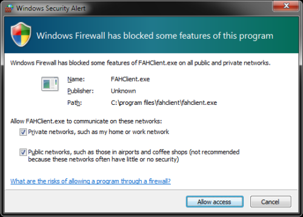

Wenn Sie dazu aufgefordert werden, wählen Sie "Entsperren" oder "Zugriff für Software erlauben", um eine Verbindung mit dem Internet herzustellen zu können.

Der Client startet darauf hin neu und zeigt die Konfigurationsseite an - die Installation ist abgeschlossen.

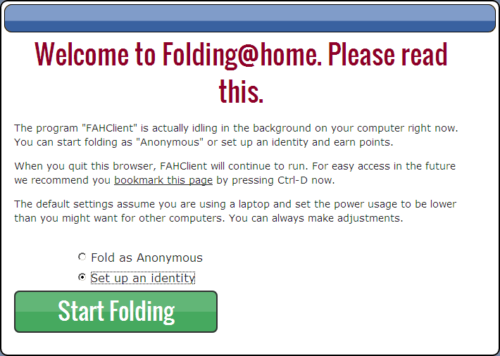

Um die Konfiguration vornehmen zu können, ist die Option zur Angabe einer Identität auszuwählen. Eine anonyme Teilnahme wird nicht empfohlen,  da sonst keine Auswahl eines Namens und eines Teams möglich ist.

