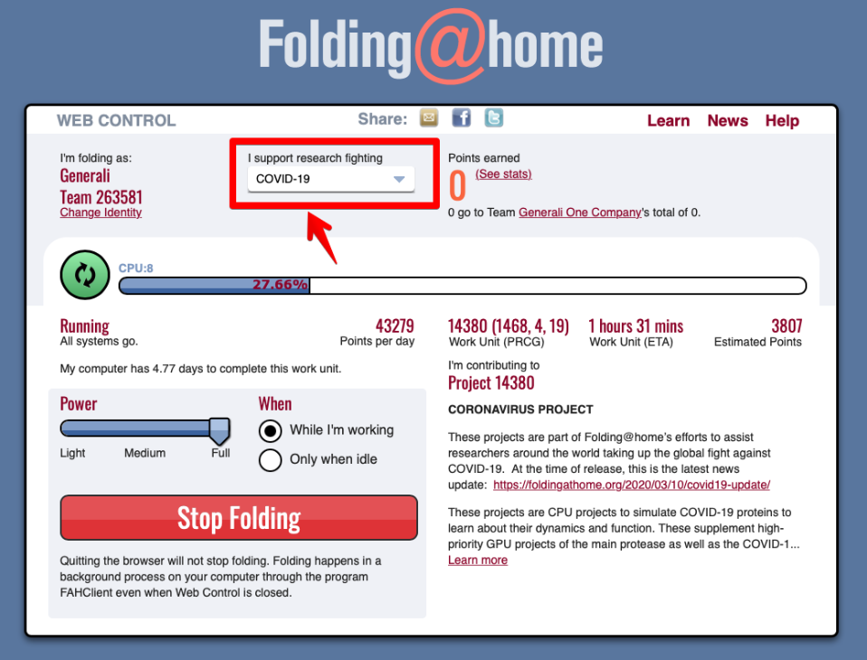
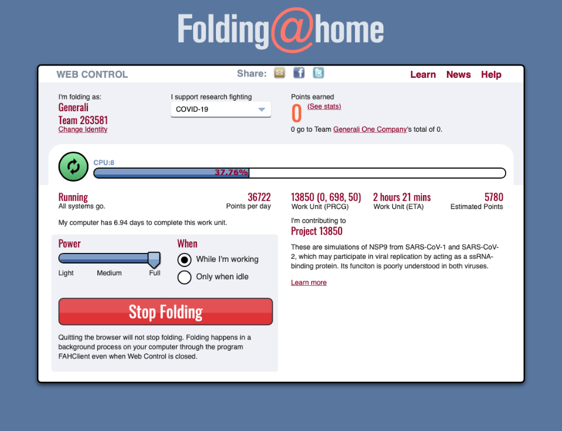

# Auswahl des Projekts \(tbt\)

Nach Angabe des Namens, der Teamnummer und des Passkey gelangst Du nach Auswahl der Schaltfläche “Save” in die Übersicht. 

In dieser Übersicht ist jetzt noch eine wichtige Einstellung vorzunehmen: das Projekt, welches Du unterstützen möchtest.

Du kannst aber auch jederzeit ein anderes Projekt unterstützen, da die Punkte nach jeder erfolgreicher Berechnung dem Team "Red Insurance Lions Worldwide" zugesprochen werden. Wir bitten Dich aber aktuell für das Projekt **COVID-19** rechnen zu lassen.

Hierzu ist folgende Auswahl in der Liste zu treffen:

| Feld | Inhalt |
| :--- | :--- |
| I support research fighting | COVID-19 |

Mit der Auswahl werden alle zukünftigen Berechnungen für dieses Projekt vorgenommen. 

Möchtest Du zudem die Berechnung etwas schneller durchführen lassen und Du bist nicht auf die Performance Deines Systems angewiesen, dann kannst Du mit dem Schieberegler

| **Feld** | Inhalt |
| :--- | :--- |
| POWER | Full |

mehr Systemressourcen der Berechnung zusprechen. Das kannst Du natürlich jederzeit an Deine Systemleistung und Deine Anforderungen anpassen.

Möchtet ihr, dass der Client nur arbeitet, wenn das System nicht ausgelastet \(Idle\) ist, wählt bitte die Option “Only when idle”.

Damit wäre die grundlegende Einstellung abgeschlossen und ihr unterstützt das Projekt Folding@Home im Generali-Team. Unseren gemeinsamen Erfolg könnt Ihr auf der Seite

[https://stats.foldingathome.org/team/263581](https://stats.foldingathome.org/team/263581)

einsehen.

