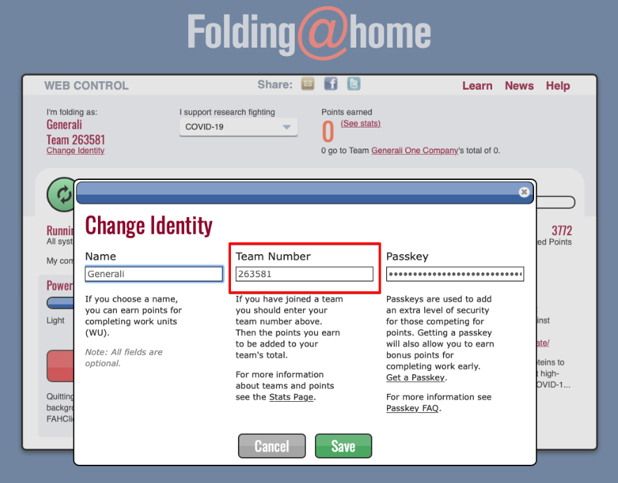

# Auswahl des Teams \(tbt\)

Beim ersten Aufruf oder durch Auswahl von dem Link “Change Identity” könnt ihr hier die wichtigsten Daten angeben:

| _Feld_ | Inhalt |
| :--- | :--- |
| Name | _Dein Name oder Pseudonym \(möglichst eindeutig\)_ Passkey: _Dein individueller Passkey \(siehe Abschnitt “Passkey”\)_ |

Wichtig ist die Eingabe der richtigen Team Number für das Red Insurance Lions Worldwide-Team:

| Feld | Inhalt |
| :--- | :--- |
| Team Number | **263581** |

