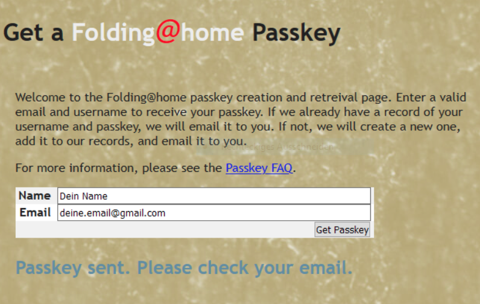

# Eindeutiger Schlüssel / Passkey \(optional\)

Du kannst optional zu Deinem Namen/Pseudonym unter

[https://apps.foldingathome.org/getpasskey](https://apps.foldingathome.org/getpasskey)

einen individuellen Schlüssel \(Passkey\) erzeugen. Damit können die Punkte später Deinem Konto immer eindeutig zugeordnet werden. Außerdem gibt es Bonuspunkte, wenn Du Dir einen Passkey erzeugst und diesen im Client angibst.

Er wird innerhalb weniger Minuten an Deine angegebene Email-Adresse gesendet.


Bei Folding@Home können die Teilnehmer sich beliebige Namen geben. Sollten mehrere Benutzer identische Namen nutzen, können diese nicht unterschieden werden. Der Passkey stellt sicher, dass die Punkte nur Deinem Konto zugesprochen werden. Es ist damit eine Hilfe zur Unterscheidung der Konten.


